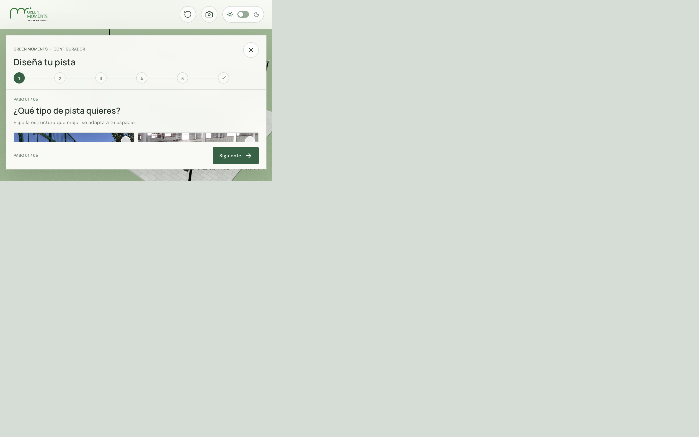
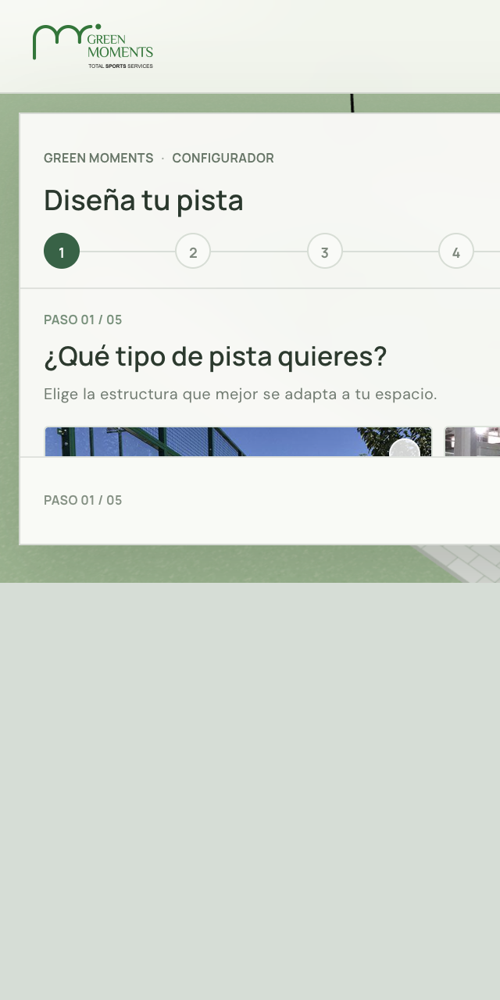

# Green Moments | Pista de pádel

Visualización 3D interactiva de una pista de pádel con césped artificial, cerramiento de vidrio y malla, iluminación, pradera texturizada, pavimento exterior y señalización Green Moments.

Permite configurar una pista en cinco pasos y ver cada cambio directamente en el render.

## Desarrollo

```sh
npm install
npm run dev
```

Abre la URL local que muestra Vite, normalmente `http://localhost:5173/`.

## Controles

- Arrastra la escena para orbitar la cámara y usa la rueda para acercar o alejar.
- Usa el botón de sol/luna para alternar la iluminación diurna y nocturna.
- Usa el botón de restablecer para recuperar el encuadre y la configuración iniciales.
- Elige entre seis modelos con fotos oficiales: modular, pilares, panorámica, individual, indoor y outdoor. También puedes configurar dos tipos de césped, siete colores, siete acabados RAL y tres opciones de iluminación.
- Revisa y edita las selecciones en el resumen; «Solicitar presupuesto» prepara un correo a `victor@greenmoments.es` con la configuración.

## Verificación

```sh
npm run build
npm run lint
```

El logotipo y la fotografía de referencia se sirven desde `public/`; ambos proceden de [greenmoments.es](https://greenmoments.es/).

## Publicar

En GitHub, abre **Settings → Pages** y selecciona **GitHub Actions** como origen. Al subir la rama `main`, el workflow de Pages compila y publica el sitio en:

https://martafrancoarco.github.io/Green-moments/

## Capturas




